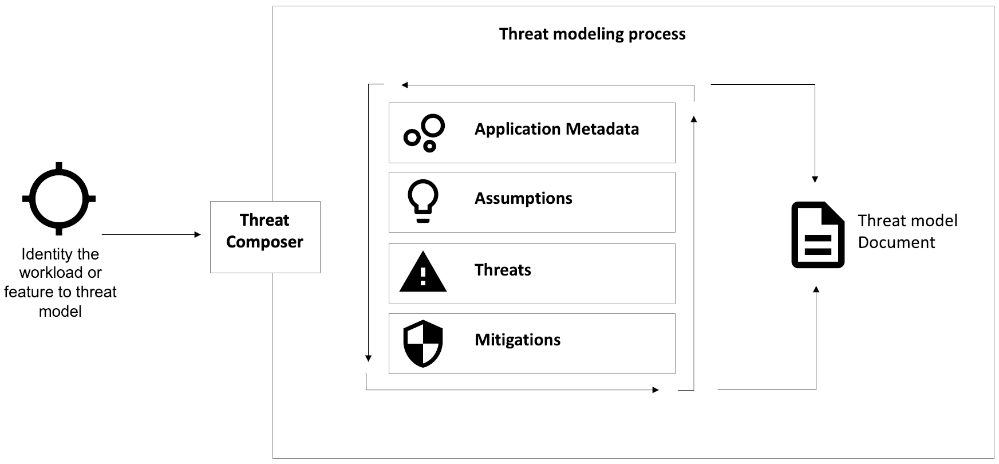
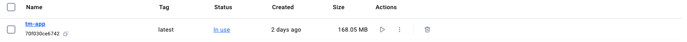
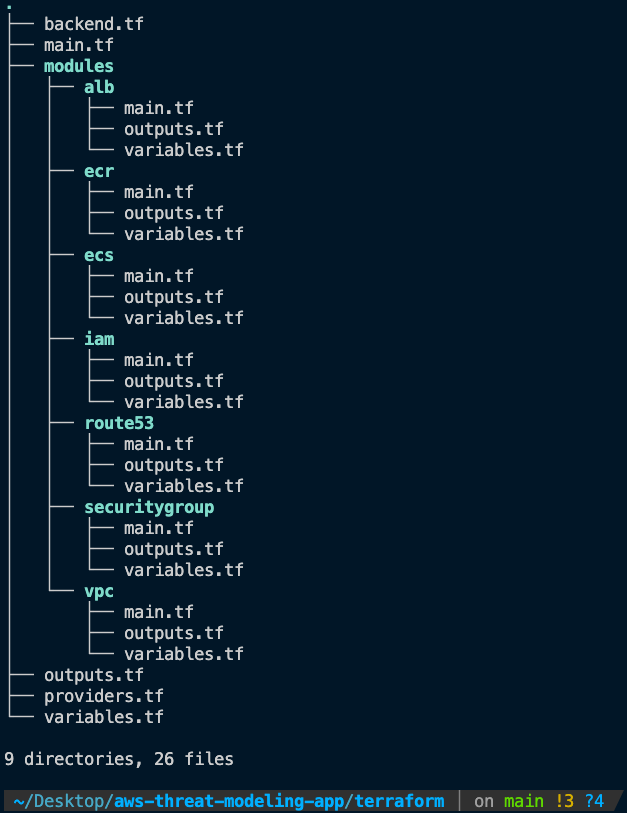
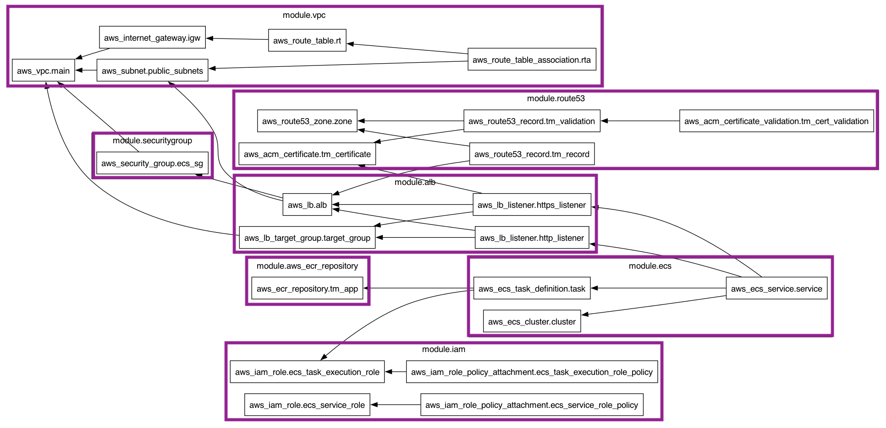

# Table of Contents

1. [Threat Modeling: Enhancing Your Security Strategy](#threat-modeling-enhancing-your-security-strategy)
2. [AWS Threat Composer: Simplifying Security Management](#aws-threat-composer-simplifying-security-management)
3. [Project Overview](#project-overview)
4. [Getting Started](#getting-started)
   - [Prerequisites](#prerequisites)
   - [Installation](#installation)
5. [Docker Setup](#docker-setup)
6. [Terraform Infrastructure](#terraform-infrastructure)
   - [Terraform AWS Architecture Breakdown](#terraform-aws-architecture-breakdown)
   - [Provisioning Terraform Resources](#provisioning-terraform-resources)
7. [CI/CD Pipeline](#cicd-pipeline)
   - [Automating Deployments with GitHub Actions Workflow](#automating-deployments-with-github-actions-workflow)
   - [Destroy Workflow](#destroy-workflow)
8. [What I Learned](#what-i-learned)
9. [Conclusion](#conclusion)
10. [Get Involved](#get-involved)

# Threat Modeling: Enhancing Your Security Strategy

Threat modeling is a critical process that helps identify security risks and develop strategies to mitigate them. The `Threat Composer` application simplifies and organises the threat modeling process, making it easier to manage security threats early in the design & adoption phase. The Threat Composer breaks down security analysis workloads into four key sections:

- **Application Metadata**: Specify the core details of your application or system.
- **Assumptions**: Identify any assumptions that might influence your security planning.
- **Threats**: List potential security risks or attack vectors that could affect your system.
- **Mitigations**: Plan and document the steps you'll take to mitigate the identified threats.

As you work through these sections, the `Threat Composer generates a comprehensive Threat Model Document`, which can be used for collaborative review and strategic security planning.



## AWS Threat Composer: Simplifying Security Management

The [AWS Threat Composer](https://github.com/awslabs/threat-composer) integrates multiple AWS services to further enhance the threat modeling process. It allows you to simulate threat scenarios, evaluate your defenses, and determine the best strategies for mitigating risks.


## Project Overview

The project demonstrates how to Dockerise and deploy a pre-built threat modeling application to AWS using modern DevOps practices. My role as a DevOps Engineer involved containerising the app with Docker, deploying it to AWS using ECS, ALB, and Route53, and managing infrastructure with Terraform. I also built a CI/CD pipeline for automated deployments, ensuring scalability and efficiency. The setup enables users to simulate real-world threat scenarios and model security vulnerabilities effectively using AWS capabilities.

## Getting Started

### Prerequisites

Make sure the following tools are installed and properly configured on your local machine, with access to an active AWS account for deploying resources.


 [](https://aws.amazon.com/)  

### Installation

Clone the Repository

```
git clone https://github.com/sohailsajid79/aws-threat-modeling-app.git
cd aws-threat-modeling-app
```

Configure [AWS CLI](https://awscli.amazonaws.com/v2/documentation/api/latest/reference/configure/index.html)

```
$ aws configure
AWS Access Key ID [None]: accesskey
AWS Secret Access Key [None]: secretkey
Default region name [None]: your region
Default output format [None]:
```

## Docker Setup

The size of the Docker image tm-app was significantly reduced to 168.05 MB, down from over 1 GB, due to optimisations made during the multi-stage build process. This reduction made the image much more efficient for a Docker container.



Build the Docker image:

```
docker build -t tm-app .
```

Run the container:

```
docker run -p 3000:3000 tm-app
```

## Terraform Infrastructure

The AWS infrastructure was organised into modular components to simplify resource management and scaling as required. Terraform was used to provision the infrastructure, with the state backend securely hosted on AWS S3, enabling reliable tracking and versioning of infrastructure changes.

Terraform Directory:



### Terraform AWS Architecture Breakdown:



1. **Provisioning the ECR Repository** - the process begins with provisioning the ECR repository to store the Docker image:

   - The CI/CD pipeline handles the Docker build automation process, it creates the Docker image from the Dockerfile, and pushes it to the ECR repository.

   AWS resources:

   - `aws_ecr_repository` for creating the ECR.

2. **Setting Up ECS** - the ECS cluster manages orchestration to run the Docker container. It defines the following components:

   - **ECS Task Definition**: Specifies the Docker image that ECS will pull and run, as well as allocating CPU, memory, and network configurations such as the VPC and subnets.
   - **ECS Service**: Manages the lifecycle of tasks, ensuring they run, scale as needed, and integrate with the ALB to route traffic to the containers via HTTP and HTTPS.

3. **Configuring IAM Roles** - the IAM roles manage security and permissions for the ECS services:

   - **Execution Role**: This role (`ecs_task_execution_role`) gives ECS tasks permission to pull the image from ECR.
   - **Service Role**: This role (`ecs_service_role`) grants ECS the ability to manage the lifecycle of the task and interact with other infrastructure components.

   AWS resources:

   - `aws_iam_role` to create the roles.
   - `aws_iam_role_policy_attachment` to attach necessary policies that define what each role can access and perform.

4. **Creating the VPC** - the VPC defines the network environment where all resources (ECS, ALB, Security Group) reside.

   - **Public Subnets**: Used to deploy the ALB, allowing it to receive internet traffic.
   - **Internet Gateway**: Enables traffic between the VPC and the public internet, making the application accessible to users.
   - **Route Tables**: Manages traffic routing within the VPC, ensuring that traffic flows correctly between the ALB, ECS tasks, and external users.

   AWS resources:

   - `aws_vpc` for creating the VPC.
   - `aws_subnet` for defining the subnets.
   - `aws_internet_gateway` and `aws_route_table` for managing traffic routes.

5. **Setting Up Security Groups** - the security groups act as a virtual firewall controlling traffic to and from resources:

   - **Security Group for ECS**: Controls inbound/outbound traffic to ECS tasks, ensuring only traffic from the ALB is allowed.
   - **Security Group for ALB**: Allows inbound HTTP (port 80) and HTTPS (port 443) traffic, enabling external users to access the application over the internet.

   AWS resources:

   - `aws_security_group` for both ECS and ALB security groups.

6. **Provisioning the ALB** - the ALB distributes incoming traffic to the ECS task and routes HTTP and HTTPS traffic to the application:

   - **HTTP Listener**: Handles traffic on port 80 and forwards it to ECS tasks.
   - **HTTPS Listener**: Handles traffic on port 443, using an SSL certificate (from ACM) for secure communication.
   - **Target Group**: Defines where the ALB forwards traffic (ECS tasks) and ensures that only healthy ECS tasks receive traffic.

   AWS resources:

   - `aws_lb` for creating the load balancer.
   - `aws_lb_listener` for configuring HTTP and HTTPS listeners.
   - `aws_lb_target_group` for routing traffic to ECS tasks.

7. **Configuring Route53 and ACM (SSL Certificate)** - Route53 manage the DNS records and ACM (AWS Certificate Manager) to provide an SSL certificate for secure HTTPS access.

   - **Route53**: A hosted zone was created for the domain sohailsajid.dev, and a DNS record points the subdomain tm.sohailsajid.dev to the ALB.
   - **ACM (SSL Certificate)**: An SSL certificate was created and validated via DNS validation (using Route53) to ensure secure HTTPS access to tm.sohailsajid.dev.

   AWS resources:

   - `aws_route53_zone` for creating the hosted zone for sohailsajid.dev.
   - `aws_route53_record` for pointing tm.sohailsajid.dev to the ALB.
   - `aws_acm_certificate` and `aws_acm_certificate_validation` for enabling HTTPS.

### Provisioning Terraform Resources

Setup Terraform remote backend on S3:

```
aws s3api create-bucket --bucket tm-app-remote-tfstate --region eu-north-1 --create-bucket-configuration LocationConstraint=eu-north-1
```

Setup S3 bucket to store name server details outptued from the Route53 module:

```
aws s3api create-bucket --bucket name-server-bucket-101 --region eu-north-1 --create-bucket-configuration LocationConstraint=eu-north-1
```

Initialise remote backend:

```
terraform init -migrate-state
```

Provision ECR before interacting with other AWS services:

```
terraform apply -target=module.aws_ecr_repository.aws_ecr_repository.tm_app -auto-approve
```

Provision Route53 hosted zone to configure the DNS records and point to the ALB:

```
terraform apply -target=module.route53.aws_route53_zone.zone
```

Provision all remaining AWS infrastructure:

```
terraform apply -auto-approve
```

Deprovision all AWS infrastructure:

```
terraform destroy --target=module.route53.aws_route53_zone.zone --auto-approve
terraform destroy -auto-approve
```

## CI/CD Pipeline

### Automating Deployments with GitHub Actions Workflow

#### Provisioning the Infrastructure Workflow

File Name: `provision-infrastructure.yaml`


The workflow automates the entire process of deploying AWS infrastructure, covering Terraform configuration for the ECR, building and pushing the Docker image, setting up the Route53 hosted zone, followed by all the remaining AWS services like ECS, ALB, and Security Group etc.

**Jobs in this workflow**:

- Job 1: Apply Terraform for ECR - `terraform-apply-ecr`
- Job 2: Build and Push Docker Image to ECR - `docker-build-push`
- Job 3: Apply Terraform for Route53 - `terraform-apply-route53`: outputs the name server details for the Route53 hosted zone. These name servers are securely stored in an S3 bucket for manual retrieval. This is essential because the name servers need to be manually added to the custom DNS settings in Namecheap to point the domain to AWS Route53 for proper DNS resolution:


**NameCheap - DNS server update may take up to 48 hours to take effect** \*\*\*

- Job 4: Apply Terraform for all remaining infrastructure (VPC, ECS, ALB, etc.) - `terraform-apply-remaining`

#### Destroy Workflow

File Name: `terraform-destroy.yaml`

This workflow is dedicated to the safe teardown of AWS infrastructure, ensuring that all resources are destroyed in the correct order.

**Jobs in this workflow**:

- Job 1: Destroy all Terraform-managed resources in the correct order. - `terraform-destroy-all`

❗ After the workflow finished, I manually removed the name server entries from the custom DNS settings in Namecheap, and reverted to Namecheap BasicDNS.

## What I Learned

Working on the Threat Composer project was an invaluable experience that allowed me to deepen my understanding with Docker, infrastructure as code, and continuous integration/continuous delivery (CI/CD) pipelines. Here's what I gained from this project:

- **AWS Expertise**: I strengthened my proficiency with AWS services, including ECS, ECR, ALB, Route53, and ACM. The project gave me hands-on experience in securely deploying a scalable application in a cloud environment.
- **Infrastructure as Code**: Managing complex cloud infrastructure using Terraform taught me the importance of modular, reusable configurations and the power of version-controlled infrastructure changes.
- **Containerisation**: Dockerising the application and optimising the image size through multi-stage build enhanced my ability to create efficient and portable application environments.
- **DevOps Best Practices**: Implementing automated deployment pipelines with GitHub Actions reinforced the need for seamless, repeatable processes that ensure code quality and infrastructure reliability.

## Conclusion

Through this project, I combined DevOps practices furthering my goal of becoming proficient in Dockerising applications, deploying infrastruscture as code with Terraform to AWS. This journey has empowered me build a journal that I can fall back on and reference when working on more complex projects in the future.

## Get Involved

Feel free to contribute to the project by forking the repository and submitting a pull request. If you encounter any issues, please don't hesitate to open an issue on GitHub. Your feedback and ideas are invaluable to my <ins>**learning**</ins>.
